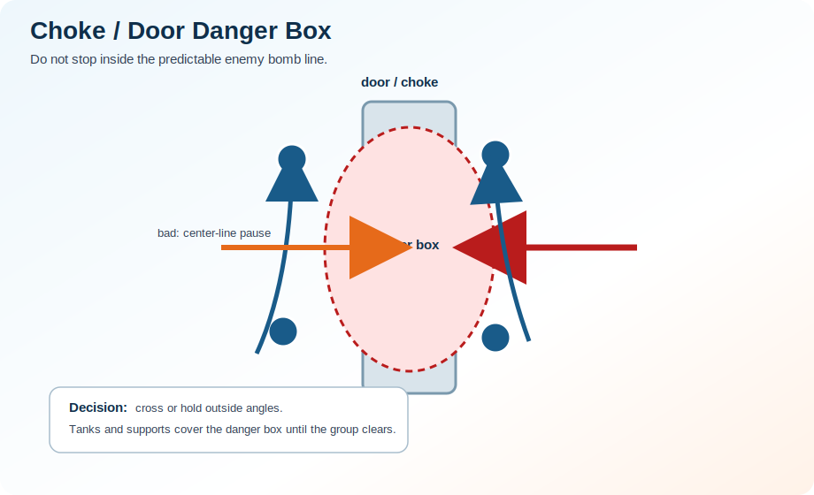

# Choke / Door Danger Box Diagram

<strong>Tactical question:</strong> Where should players avoid stopping during a crossing?

{ .diagram }

## What to learn

Do not stop in the predictable bomb box. Cross with purpose while tanks/supports cover the danger line.

## Common failure

Players often understand the call but choose a bad shape or path. Use the diagram to review whether the zerg's movement created safe value or gave the enemy an easy bomb target.

## Related pages

- [Movement and Positioning](../fight-concepts/movement-positioning.md)
- [Terrain and Geometry](../fight-concepts/terrain-geometry.md)
- [Practical Examples](../practical-examples/index.md)
