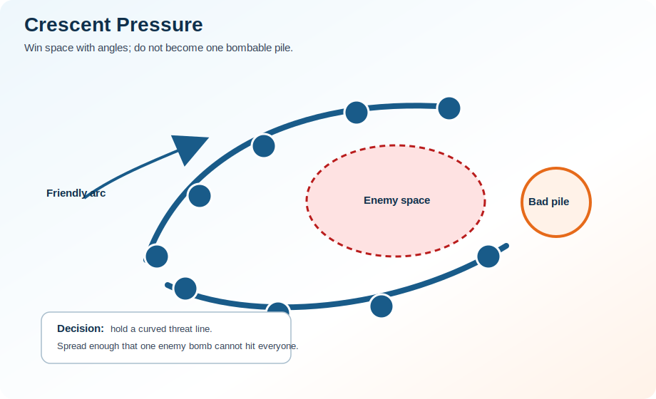

# Diagram Brief: Crescent Pressure

## Purpose

Show a zerg spread in a curved shape around enemy space, threatening multiple paths without becoming one clump.

## Must show

- friendly zerg
- enemy zerg or threat
- danger area
- correct movement path
- common mistake path
- one clear teaching point

## Do not include yet

- private player names
- exact guild VOD screenshots unless cleared
- cluttered icons that make the lesson harder to read

## Related pages

- Fight Concepts
- Role Guides
- Practical Examples

## Draft diagram

{ .diagram }

This is an original draft diagram for teaching. It should be improved visually later, but the tactical idea is now represented.
