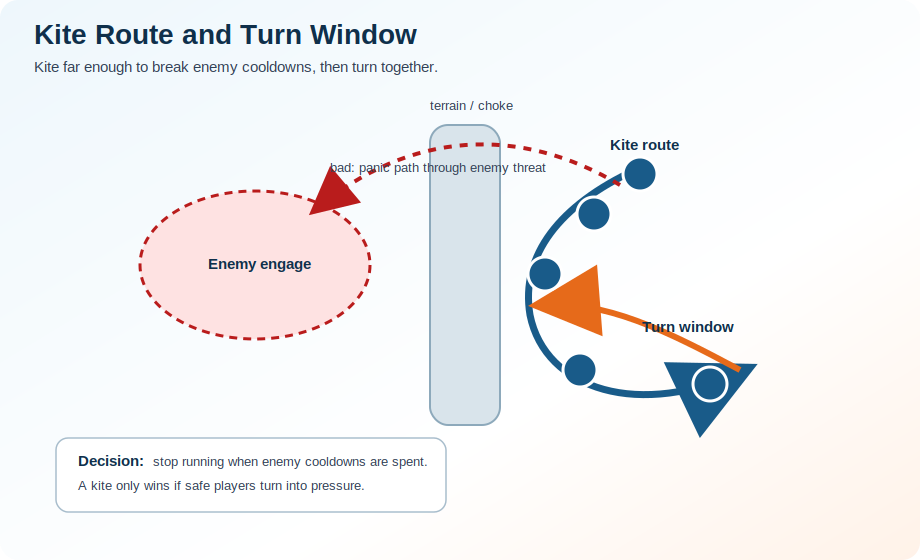

# Kite Route and Turn Window Diagram

<strong>Tactical question:</strong> When does a kite become a turn instead of endless running?

{ .diagram }

## What to learn

Kite far enough to break enemy cooldowns, then stop giving ground and turn with safe players.

## Common failure

Players often understand the call but choose a bad shape or path. Use the diagram to review whether the zerg's movement created safe value or gave the enemy an easy bomb target.

## Related pages

- [Movement and Positioning](../fight-concepts/movement-positioning.md)
- [Terrain and Geometry](../fight-concepts/terrain-geometry.md)
- [Practical Examples](../practical-examples/index.md)
